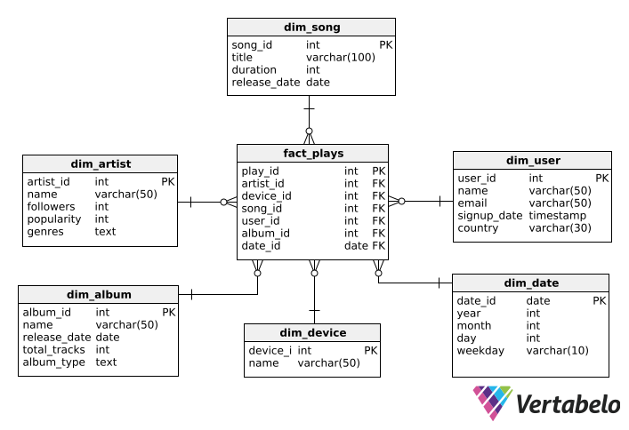

# 📊 SoundWave Star Schema — Data Warehouse

This document presents the **star schema** used to model the SoundWave Analytics Data Warehouse.

It follows best practices for analytical data modeling, enabling efficient querying, reporting, and dashboarding for a music streaming platform.

---

## 🌟 Star Schema Overview

- **Fact Table**: `fact_plays`  
  Captures every play event by users, including references to dimensions like user, song, artist, album, device, and date.

- **Dimension Tables**:
  - `dim_user`: User details
  - `dim_song`: Song metadata
  - `dim_artist`: Artist popularity and genre
  - `dim_album`: Album context
  - `dim_device`: Device used for streaming
  - `dim_date`: Calendar details for temporal analysis

---

## 📎 Diagram

---

## 💡 Why a Star Schema?

This design:
- Avoids complex joins by connecting all dimensions directly to the fact table
- Prioritizes **read performance** for BI tools like Power BI or Tableau
- Matches modern architectures used by companies like Spotify or Netflix

---

_Last updated by [@LuisUmina](https://github.com/LuisUmina)_
